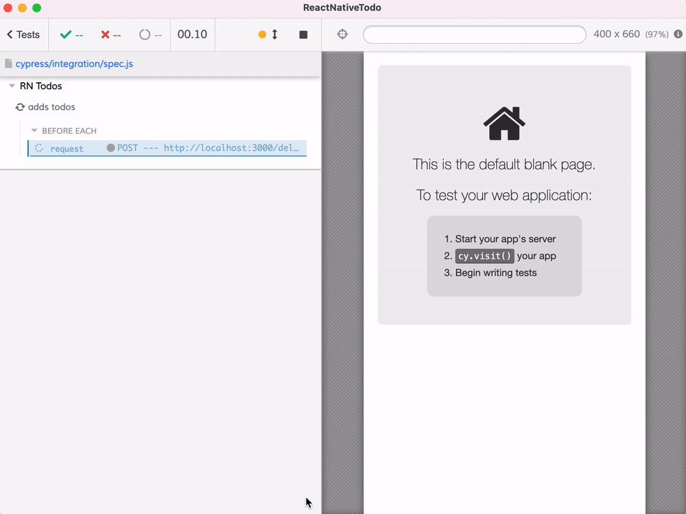

# ReactNativeTodo
> Example testing ReactNative Todo app using Cypress



For general advice on testing the ReactNative apps running using Expo using [Cypress.io](https://www.cypress.io) test runner, read [The Complete Guide to Testing React Native App Using Cypress](https://glebbahmutov.com/blog/testing-react-native-app-using-cypress/).

## Add Expo

First, let's add [Expo](https://docs.expo.io/guides/running-in-the-browser/) to this project to be able to work with the RN app in the browser. Follow the example in [bahmutov/react-native-to-expo](https://github.com/bahmutov/react-native-to-expo).

```text
# match the React DOM version to the React version
$ npm i -D expo expo-cli react-native-web react-dom@17.0.1 babel-preset-expo
+ react-dom@17.0.1
+ react-native-web@0.17.0
+ expo-cli@4.5.2
+ expo@41.0.1
+ babel-preset-expo@8.3.0
```

Then I started using Expo icons and fonts to make sure the app looks in the browser the same as on iOS.

## The server

The TODO API server is in the folder [server](./server). To start it at port 3000 run `npm run start:server`.

## Cypress tests

See the tests in [cypress/integration/spec.js](./cypress/integration/spec.js)

To start the server, the Expo app, and Cypress use:

```text
$ npm run dev
```

## Attribution

This code was originally copied from [stassop/ReactNativeTodo](https://github.com/stassop/ReactNativeTodo). The original unit and integration tests were described in the blog post [Quick Guide to React Native Testing](https://stassop.medium.com/quick-guide-to-react-native-testing-a5a830223c9e) by [Stanislav Sopov](https://github.com/stassop).
